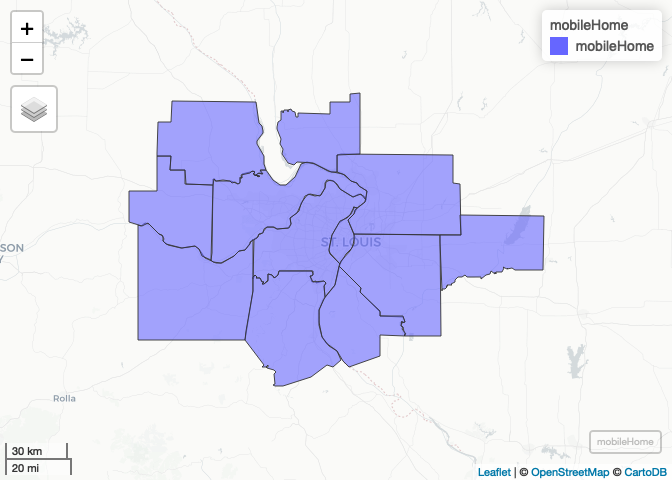
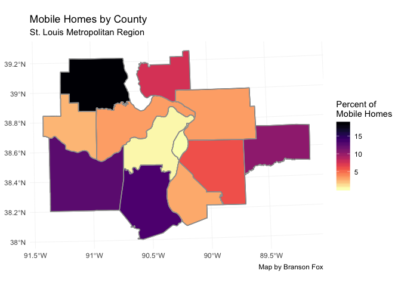
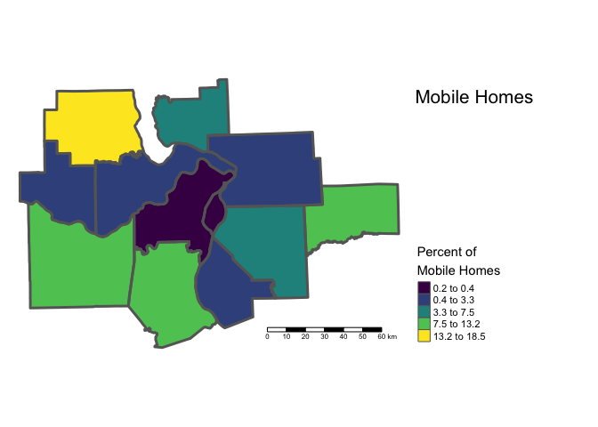
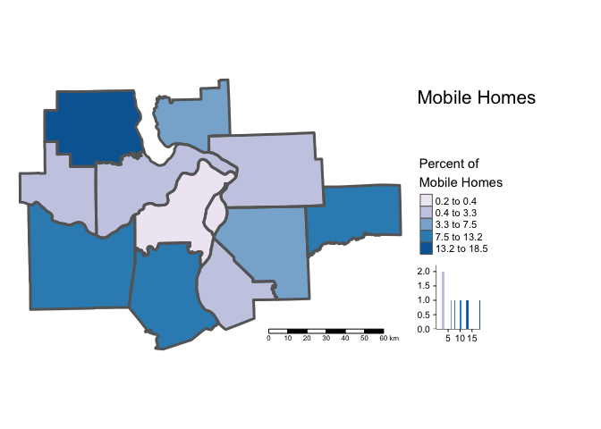

Lab-05-Replication
================
Branson Fox
(February 24, 2019)

## Introduction

This notebook replicates the results of Lab-05.

## Dependencies

This notebook requires the following packages to load our data and
create maps

``` r
# tidyverse packages
library(ggplot2)      # data visualization

# spatial packages
library(sf)           # tools for spatial data
```

    ## Linking to GEOS 3.6.1, GDAL 2.1.3, PROJ 4.9.3

``` r
library(mapview)      # interactive mapping preview
library(tmap)         # thematic map making

# other packages
library(here)         # file path management
```

    ## here() starts at /Users/chris/GitHub/SOC5650/LectureRepos/lecture-06/assignments/lab-05-replication

``` r
library(RColorBrewer) # color palettes
library(viridis)      # color palettes
```

    ## Loading required package: viridisLite

## Load Data

This notebook requires data from the Lecture-06 repository, that we
should have put in the `data/` directory of our
project.

``` r
counties <- st_read(here("data", "METRO_BOUNDARY_Counties", "METRO_BOUNDARY_Counties.shp"), stringsAsFactors = FALSE)
```

    ## Reading layer `METRO_BOUNDARY_Counties' from data source `/Users/chris/GitHub/SOC5650/LectureRepos/lecture-06/assignments/lab-05-replication/data/METRO_BOUNDARY_Counties/METRO_BOUNDARY_Counties.shp' using driver `ESRI Shapefile'
    ## Simple feature collection with 12 features and 11 fields
    ## geometry type:  POLYGON
    ## dimension:      XY
    ## bbox:           xmin: 637438.5 ymin: 4208959 xmax: 836287.1 ymax: 4349723
    ## epsg (SRID):    26915
    ## proj4string:    +proj=utm +zone=15 +datum=NAD83 +units=m +no_defs

``` r
mobileHome <- st_read(here("data", "METRO_STRUCTURE_PctMobileHome", "METRO_STRUCTURE_PctMobileHome.shp"), stringsAsFactors = FALSE)
```

    ## Reading layer `METRO_STRUCTURE_PctMobileHome' from data source `/Users/chris/GitHub/SOC5650/LectureRepos/lecture-06/assignments/lab-05-replication/data/METRO_STRUCTURE_PctMobileHome/METRO_STRUCTURE_PctMobileHome.shp' using driver `ESRI Shapefile'
    ## Simple feature collection with 12 features and 24 fields
    ## geometry type:  POLYGON
    ## dimension:      XY
    ## bbox:           xmin: 637438.5 ymin: 4208959 xmax: 836287.1 ymax: 4349723
    ## epsg (SRID):    26915
    ## proj4string:    +proj=utm +zone=15 +datum=NAD83 +units=m +no_defs

## Part 1: Data Exploration

### Question 1

We will start by exploring the variables in our mobileHome data using
the `str()` function.

``` r
str(mobileHome)
```

    ## Classes 'sf' and 'data.frame':   12 obs. of  25 variables:
    ##  $ STATEFP   : chr  "29" "29" "29" "29" ...
    ##  $ COUNTYFP  : chr  "189" "071" "183" "510" ...
    ##  $ COUNTYNS  : chr  "00758549" "00758490" "00758546" "00767557" ...
    ##  $ AFFGEOID  : chr  "0500000US29189" "0500000US29071" "0500000US29183" "0500000US29510" ...
    ##  $ GEOID     : chr  "29189" "29071" "29183" "29510" ...
    ##  $ NAME      : chr  "St. Louis" "Franklin" "St. Charles" "St. Louis City" ...
    ##  $ LSAD      : chr  "06" "06" "06" "25" ...
    ##  $ ALAND     : num  1.32e+09 2.39e+09 1.45e+09 1.60e+08 1.70e+09 ...
    ##  $ AWATER    : num  39385817 20729139 83314211 10670040 42081592 ...
    ##  $ OBJECTID_1: num  1147 1141 1151 1145 510 ...
    ##  $ STATE     : chr  "MO" "MO" "MO" "MO" ...
    ##  $ CWA       : chr  "LSX" "LSX" "LSX" "LSX" ...
    ##  $ COUNTYNAME: chr  "St. Louis" "Franklin" "St. Charles" "St. Louis City" ...
    ##  $ FIPS      : int  29189 29071 29183 29510 17163 17119 17027 17187 17133 17083 ...
    ##  $ TIME_ZONE : chr  "C" "C" "C" "C" ...
    ##  $ FE_AREA   : chr  "ec" "ec" "ec" "ec" ...
    ##  $ LON       : num  -90.4 -91.1 -90.5 -90.2 -90 ...
    ##  $ LAT       : num  38.6 38.5 38.8 38.7 38.4 ...
    ##  $ MobileHome: num  0.4 12.5 3.3 0.2 6 3.3 10.3 2.5 2.9 7.5 ...
    ##  $ ErrorMargi: num  0.1 1.2 0.3 0.1 0.4 0.3 1.4 1.2 1.1 1.6 ...
    ##  $ Shape_Leng: num  207713 222926 240603 64486 177900 ...
    ##  $ Shape_Area: num  1.35e+09 2.39e+09 1.50e+09 1.80e+08 1.71e+09 ...
    ##  $ Shape_Le_1: num  2.252 2.279 2.642 0.652 1.896 ...
    ##  $ Shape_Ar_1: num  0.1403 0.2486 0.1591 0.0177 0.1802 ...
    ##  $ geometry  :sfc_POLYGON of length 12; first list element: List of 1
    ##   ..$ : num [1:453, 1:2] 697472 697478 697473 697481 697468 ...
    ##   ..- attr(*, "class")= chr  "XY" "POLYGON" "sfg"
    ##  - attr(*, "sf_column")= chr "geometry"
    ##  - attr(*, "agr")= Factor w/ 3 levels "constant","aggregate",..: NA NA NA NA NA NA NA NA NA NA ...
    ##   ..- attr(*, "names")= chr  "STATEFP" "COUNTYFP" "COUNTYNS" "AFFGEOID" ...

The important variable here is `MobileHome` which represents the
percentage of homes that are mobile homes in each county.

### Question 2

Next, we will create an interactive preview of these data using the
`mapview()` function.

``` r
mapview(mobileHome)
```

<!-- -->

We can observe that these data are to the extent of the Greater
St. Louis Metropolitan Area.

## Part 2: Static Mapping for Digital Use

### Question 3

Now, we will create a static map using `ggplot2`.

Here is the process broken down:

1.  Make a call to the `ggplot()` function

2.  Add layers with the `geom_sf()` function, specifying the name of
    your data

3.  Create an aesthetic mapping using `MobileHome` as the fill variable

4.  Set the fill to NA for the counties, and choose an appropriate color
    for the outline

5.  Add a `scale_fill_` argument. In this example, I used viridis, but
    you can use RColorBrewer with `scale_fill_distiller()`

6.  Add a name to your scale, as well as a title, subtitle and caption.

7.  Add the `theme_minimal()` to hide some default `ggplot2` elements

8.  Save the plot to a new object, and print the object after.

<!-- end list -->

``` r
# create a ggplot object
ggplot() +
  geom_sf(data = mobileHome, mapping = aes(fill = MobileHome)) +
  geom_sf(data = counties, fill = NA, color = "#A3A3A3") +
  scale_fill_viridis(option = "magma", name = "Percent of\nMobile Homes", direction = -1) +
  labs(
    title = "Mobile Homes by County",
    subtitle = "St. Louis Metropolitan Region",
    caption = "Map by Branson Fox"
  ) +
  theme_minimal() -> ggplot_mbHome

# print the object
ggplot_mbHome
```

<!-- -->

### Question 4

Now, we want to save the map we created. To do this, we will use the
`ggsave()` function along with `here()` to specify what we would like to
save, in what format, and where.

``` r
ggsave(here("results", "ggplot_mbHome.png"), ggplot_mbHome, dpi = 500)
```

    ## Saving 7 x 5 in image

## Part 3: Static Mapping for Print Use

### Question 5

We will now create a static map for print use using the `tmap` package.

Here is the process broken down:

1.  Use `tm_shape()` to add layers with your data

2.  `tm_polygons()` is used to create a thematic fill, specifying your
    fill variable to `col =` and then choosing your palette and style
    and adding a legend title.

3.  For the `counties` data, we add it with `tm_shape()` and specify the
    line width and color to `tm_borders()`

4.  We add a scale bar with `tm_scale_bar()`

5.  We add a title, remove the border and position the legend in
    `tm_layout()`

6.  Assign and print the object

<!-- end list -->

``` r
# create tmap object
tm_shape(mobileHome) +
  tm_polygons(
    col = "MobileHome",
    palette = "viridis",
    style = "jenks",
    title = "Percent of\nMobile Homes"
    ) +
tm_shape(counties) +
  tm_borders(lwd = 3, col = "#666666") +
  tm_scale_bar() +
  tm_layout(
    title = "Mobile Homes",
    frame = FALSE,
    legend.outside = TRUE,
    legend.position = c("left", "bottom")) -> tmap_mbHome
  
# print object
tmap_mbHome
```

<!-- -->

### Question 6

Now, we will save the map we created with `tmap_save`. Again, we will
use `here()` to specify where the file should be
exported.

``` r
tmap_save(tm = tmap_mbHome, filename = here("results", "tmap_mbHome.pdf"), dpi = 500)
```

    ## Map saved to /Users/chris/GitHub/SOC5650/LectureRepos/lecture-06/assignments/lab-05-replication/results/tmap_mbHome.pdf

    ## Size: 7 by 5 inches

### Question 7

We will create the same map again, but change our color palette and add
a histogram this time. We will use of the RColorBrewer palettes, in this
example `PuBu` and add the argument `legend.hist = TRUE` to the
`tm_polygons()` function.

``` r
# create tmap object
tm_shape(mobileHome) +
  tm_polygons(
    col = "MobileHome",
    palette = "PuBu",
    style = "jenks",
    title = "Percent of\nMobile Homes",
    legend.hist = TRUE
    ) +
tm_shape(counties) +
  tm_borders(lwd = 3, col = "#666666") +
  tm_scale_bar() +
  tm_layout(
    title = "Mobile Homes",
    frame = FALSE,
    legend.outside = TRUE,
    legend.position = c("left", "bottom")) -> tmap_mbHome_hist
  
# print object
tmap_mbHome_hist
```

<!-- -->

### Question 8

We will save the map in the same format as before, but with a different
name this
time.

``` r
tmap_save(tm = tmap_mbHome_hist, filename = here("results", "tmap_mbHome_hist.pdf"), dpi = 500)
```

    ## Map saved to /Users/chris/GitHub/SOC5650/LectureRepos/lecture-06/assignments/lab-05-replication/results/tmap_mbHome_hist.pdf

    ## Size: 7 by 5 inches
