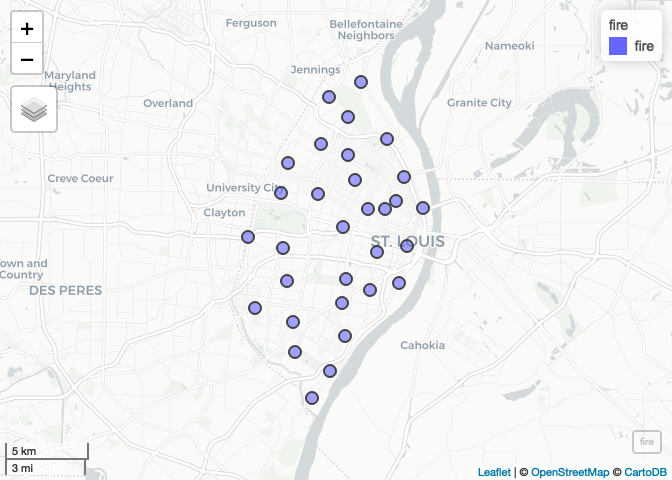
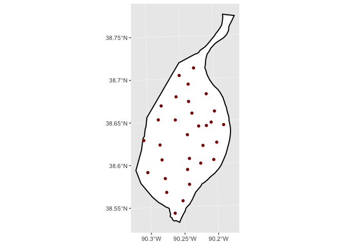
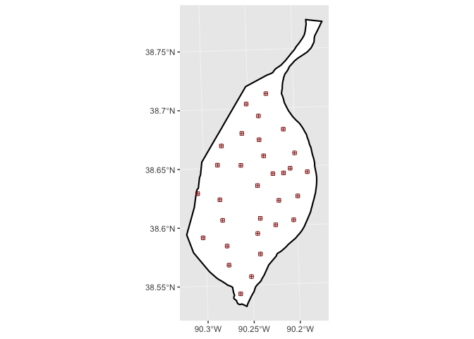
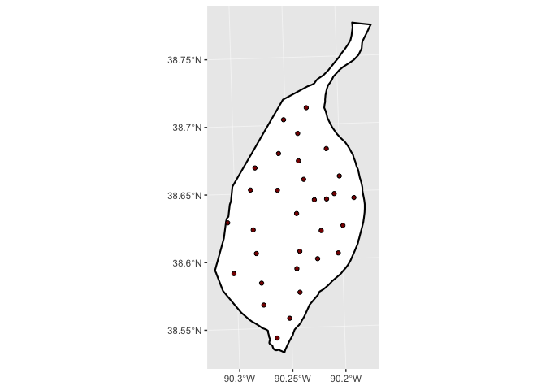
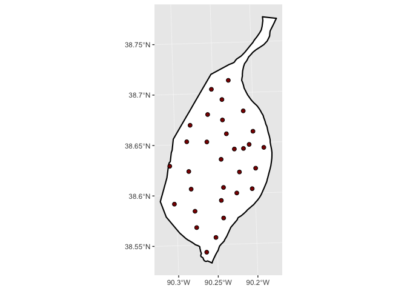
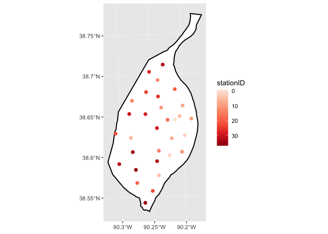
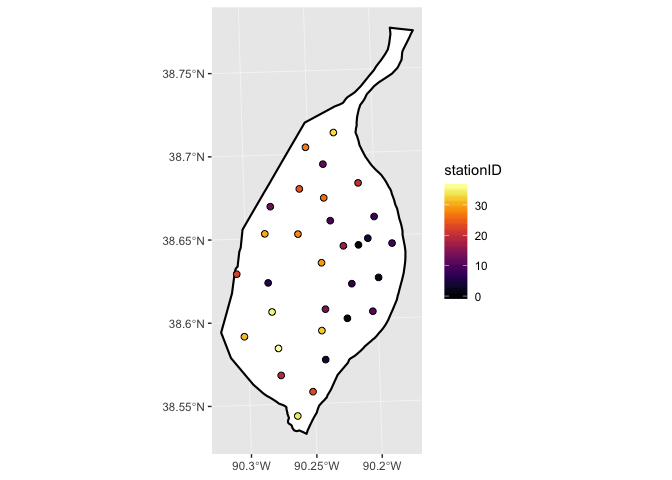
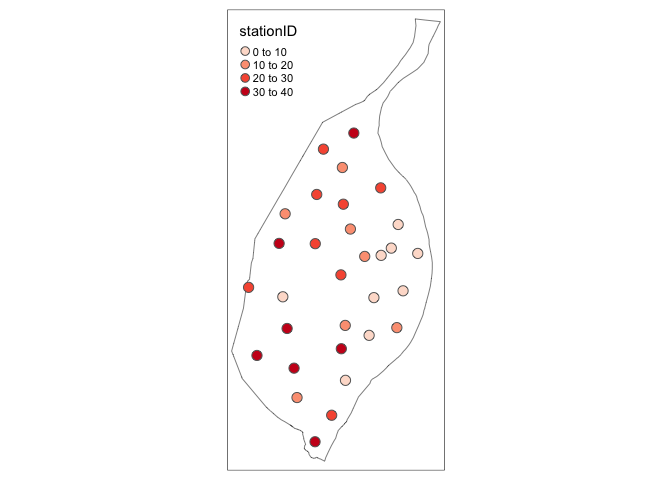
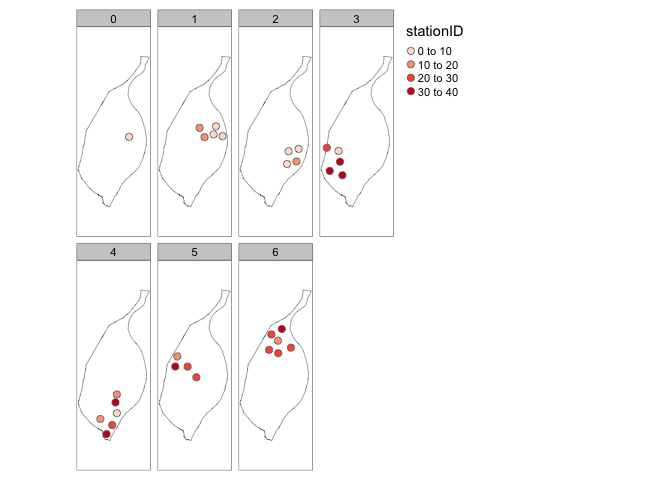

Lecture-06 Examples
================
Christopher Prener, Ph.D.
(March 04, 2019)

## Introduction

This notebook covers basic map production in `R` using a variety of
tools for producing *static* maps (as opposed to the interactive maps
`leaflet` makes).

## Dependencies

This notebook requires a variety of packages for working with spatial
data:

``` r
# tidyverse packages
library(ggplot2)      # plotting data
library(magrittr)     # pipe operator

# spatial packages
library(mapview)      # preview spatial data
library(tmap)         # map layouts
library(sf)           # spatial data tools
```

    ## Linking to GEOS 3.6.1, GDAL 2.1.3, PROJ 4.9.3

``` r
# other packages
library(here)         # file path management
```

    ## here() starts at /Users/chris/GitHub/SOC5650/LectureRepos/lecture-06

``` r
library(RColorBrewer) # color palettes
library(viridis)      # color palettes
```

    ## Loading required package: viridisLite

## Load Data and Re-project

This notebook requires the data stored in `data/example-data/`. Remember
that we use `sf::st_read()` to load shapefile data. This time, however,
we’ll combine our `st_read()` call with `st_transform()` in a pipeline.
We’ll need to load the pipe operator using the `magrittr` package. We
use `magrittr` and not `dplyr` here because we do not need the extra
features of `dplyr`.

``` r
# city boundary
st_read(here("data", "example-data", "STL_BOUNDARY_City", 
             "STL_BOUNDARY_City.shp"), stringsAsFactors = FALSE) %>%
  st_transform(crs = 32615) -> city
```

    ## Reading layer `STL_BOUNDARY_City' from data source `/Users/chris/GitHub/SOC5650/LectureRepos/lecture-06/data/example-data/STL_BOUNDARY_City/STL_BOUNDARY_City.shp' using driver `ESRI Shapefile'
    ## Simple feature collection with 1 feature and 17 fields
    ## geometry type:  POLYGON
    ## dimension:      XY
    ## bbox:           xmin: -90.32052 ymin: 38.53185 xmax: -90.16657 ymax: 38.77443
    ## epsg (SRID):    NA
    ## proj4string:    +proj=longlat +ellps=GRS80 +no_defs

``` r
# fire stations
st_read(here("data", "example-data", "STL_PUBLICSAFTEY_FireStations", 
             "STL_PUBLICSAFTEY_FireStations.shp"), stringsAsFactors = FALSE) %>%
  st_transform(crs = 32615) -> fire
```

    ## Reading layer `STL_PUBLICSAFTEY_FireStations' from data source `/Users/chris/GitHub/SOC5650/LectureRepos/lecture-06/data/example-data/STL_PUBLICSAFTEY_FireStations/STL_PUBLICSAFTEY_FireStations.shp' using driver `ESRI Shapefile'
    ## Simple feature collection with 31 features and 10 fields
    ## geometry type:  POINT
    ## dimension:      XY
    ## bbox:           xmin: 875263.6 ymin: 986543.2 xmax: 909445.5 ymax: 1048371
    ## epsg (SRID):    NA
    ## proj4string:    +proj=tmerc +lat_0=35.83333333333334 +lon_0=-90.5 +k=0.9999333333333333 +x_0=250000 +y_0=0 +datum=NAD83 +units=us-ft +no_defs

## Exploring the Data

We can use `mapview()` to explore our point data:

``` r
mapview(fire)
```

<!-- -->

We have two variables we’ll be focusing on, the `stationID` variable (to
simulate mapping point data with a quantitative attribute) and the
`battalion`, which we’ll use for creating our facets.

## Mapping Points

### Using `ggplot2`

There are two differences we need to be conscious of when we plot points
using `ggplot2`. The first is that we need to use a different argument
for applying colors and aesthetic mappings. Instead of using `fill` as
we did with our polygon features, we want to use `color`.

``` r
ggplot() +
  geom_sf(data = city, fill = "#ffffff", color = "#000000", size = .75) +
  geom_sf(data = fire, color = "#8b0000") 
```

<!-- -->

With polygon data like the city boundary, the `color` arguments are used
to control the border. With point data, the `color` argument is used to
fill in the symbols.

#### Basic Options

We can extend this functionality by changing shapes. The default for
`geom_sf()` is to use
[shape 16](http://www.sthda.com/english/wiki/ggplot2-point-shapes). We
can change shapes by using the `shape` argument:

``` r
ggplot() +
  geom_sf(data = city, fill = "#ffffff", color = "#000000", size = .75) +
  geom_sf(data = fire, color = "#8b0000", shape = 12)
```

<!-- -->

One technique we use in cartography is to add a black border around
points to make them stand out. We can achieve this with shape 21 (for
circular symbols):

``` r
ggplot() +
  geom_sf(data = city, fill = "#ffffff", color = "#000000", size = .75) +
  geom_sf(data = fire, fill = "#8b0000", shape = 21) 
```

<!-- -->

Notice here that we’ve switched back to using `fill`. If we also
supplied a `color` argument, it would change the border color (as it
does with polygon data). Finally, with point data, we can change the
size of the symbol using the `size` argument:

``` r
ggplot() +
  geom_sf(data = city, fill = "#ffffff", color = "#000000", size = .75) +
  geom_sf(data = fire, fill = "#8b0000", shape = 21, size = 2) 
```

<!-- -->

#### Applying Aesthetic Mappings

We can also use asthetic mappings with these data, much as we did with
polygon data. If we use any of the simple shapes, we use the `color`
argument inside of our aesthetic mapping and either
`scale_color_distiller()` or `scale_color_viridis()`:

``` r
ggplot() +
  geom_sf(data = city, fill = "#ffffff", color = "#000000", size = .75) +
  geom_sf(data = fire, mapping = aes(color = stationID), size = 2) +
  scale_color_distiller(palette = "Reds", trans = "reverse")
```

<!-- -->

If we were to use the point symbol with a border, we would use the
`fill` arguments instead along with either `scale_fill_distiller()` or
`scale_fill_viridis()`:

``` r
ggplot() +
  geom_sf(data = city, fill = "#ffffff", color = "#000000", size = .75) +
  geom_sf(data = fire, mapping = aes(fill = stationID), shape = 21, size = 2) +
  scale_fill_viridis(option = "inferno")
```

<!-- -->

### Using `tmap`

We can achieve the same effects using the `tmap` package. A basic point
map would use `tm_shape()` twice, once to add the city background and
once to add the fire stations. We use `tm_polygons()` to customize the
apperance of the city layer and `tm_symbols()` to customize the
appearence of the points.

``` r
tm_shape(city) +
  tm_polygons(col = "#ffffff", lwd = .75) +
  tm_shape(fire) +
  tm_symbols(col = "#8b0000", size = .5)
```

<!-- -->

Similarly, we can use `tm_lines()` to customize line elements.

If we wanted to mirrior the aesthetic mappings from `ggplot2`, we can
adjust our `tmap` call slightly. Instead of declaring a color in
`tm_symbols(col)`, we specify a variable:

``` r
tm_shape(city) +
  tm_polygons(col = "#ffffff", lwd = .75) +
  tm_shape(fire) +
  tm_symbols(col = "stationID", palette = "Reds", size = .5)
```

<!-- -->

## Small Multiples

We can map these in groups according to any characteristic (typically a
categorical or ordinal variable) using a technique called faceting.
Facets implement the idea of “small multiples” - multiple plots of the
same scale (or spatial area) showing data according to the specified
characteristics. We can do this in `ggplot2` using the `facet_grid()`
and `facet_wrap()` functions. For what it is worth, `facet_wrap()` often
producing more pleasing output:

``` r
ggplot() +
  geom_sf(data = city, fill = "#ffffff", color = "#000000", size = .75) +
  geom_sf(data = fire, mapping = aes(fill = stationID), shape = 21, size = 2) +
  scale_fill_distiller(palette = "Reds", trans = "reverse") +
  labs(
    title = "Stations by Battalion",
    subtitle = "St. Louis Fire Department"
  ) +
  theme_minimal() +
  facet_wrap(~battalion)
```

<!-- -->

Nothing should change about your call execept for the addition of
`facet_wrap()` at the end of your call. Note the addition of the tilde
(`~`) in the function call - thsi is important\!

We can achieve a similar effect with the `tm_facets()` function in
`tmap`. Instead of a tilde, we specify the grouping variable with the
`by =` argument:

``` r
tm_shape(city) +
  tm_polygons(col = "#ffffff", lwd = .75) +
  tm_shape(fire) +
  tm_symbols(col = "stationID", palette = "Reds", size = .5) +
  tm_facets(by = "battalion", free.coords = FALSE)
```

<!-- -->

The `free.cords` argument ensures that our data are mapped to the same
extent in each multiple. Without it, `tmap` will zoom in to the closest
possible extent in each panel, which defeats the visual effect of
faceting.
