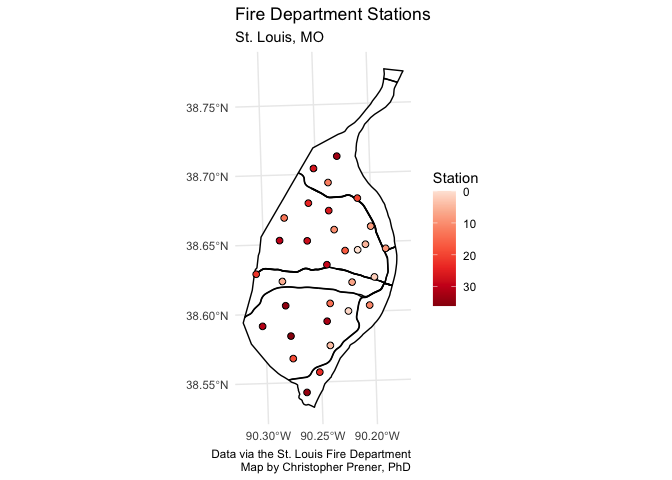
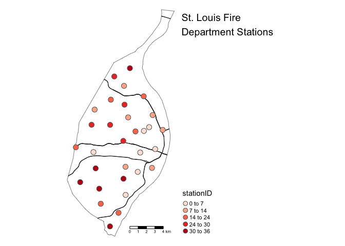

Meeting Examples
================
Christopher Prener, Ph.D.
(April 26, 2021)

## Introduction

This notebook covers basic map production in `R` using a variety of
tools for producing *static* maps (as opposed to the interactive maps
`leaflet` makes).

## Dependencies

This notebook requires a variety of packages for working with spatial
data. We’ll also be using a new package called `cowplot` - make sure you
install it first using:

``` r
install.packages("cowplot")
```

Once that is installed, we can load our packages:

``` r
# tidyverse packages
library(dplyr)        # data wrangling
```

    ## 
    ## Attaching package: 'dplyr'

    ## The following objects are masked from 'package:stats':
    ## 
    ##     filter, lag

    ## The following objects are masked from 'package:base':
    ## 
    ##     intersect, setdiff, setequal, union

``` r
library(ggplot2)      # plotting data

# spatial packages
library(mapview)      # preview spatial data
```

    ## GDAL version >= 3.1.0 | setting mapviewOptions(fgb = TRUE)

``` r
library(tigris)       # access TIGER/Line data
```

    ## To enable 
    ## caching of data, set `options(tigris_use_cache = TRUE)` in your R script or .Rprofile.

``` r
library(tmap)         # map layouts
library(sf)           # spatial data tools
```

    ## Linking to GEOS 3.8.1, GDAL 3.1.4, PROJ 6.3.1

``` r
# other packages
library(cowplot)      # map theme
library(here)         # file path management
```

    ## here() starts at /Users/chris/GitHub/slu-soc5650/content/module-5-static

``` r
library(RColorBrewer) # color palettes
library(viridis)      # color palettes
```

    ## Loading required package: viridisLite

## Load Data and Re-project

This notebook requires the data stored in `data/example-data/`. Remember
that we use `sf::st_read()` to load shapefile data. We’ll combine our
`st_read()` call with `st_transform()` in a pipeline, and for our `city`
data, we’ll subset down to a single column.

``` r
# city boundary
city <- st_read(here("data", "example-data", "STL_BOUNDARY_City", 
             "STL_BOUNDARY_City.shp"), stringsAsFactors = FALSE) %>%
  st_transform(crs = 26915) %>%
  select(NAMELSAD)
```

    ## Reading layer `STL_BOUNDARY_City' from data source `/Users/chris/GitHub/slu-soc5650/content/module-5-static/data/example-data/STL_BOUNDARY_City/STL_BOUNDARY_City.shp' using driver `ESRI Shapefile'
    ## Simple feature collection with 1 feature and 17 fields
    ## geometry type:  POLYGON
    ## dimension:      XY
    ## bbox:           xmin: -90.32052 ymin: 38.53185 xmax: -90.16657 ymax: 38.77443
    ## geographic CRS: GRS 1980(IUGG, 1980)

``` r
# fire stations
fire <- st_read(here("data", "example-data", "STL_PUBLICSAFTEY_FireStations", 
             "STL_PUBLICSAFTEY_FireStations.shp"), stringsAsFactors = FALSE) %>%
  st_transform(crs = 26915)
```

    ## Reading layer `STL_PUBLICSAFTEY_FireStations' from data source `/Users/chris/GitHub/slu-soc5650/content/module-5-static/data/example-data/STL_PUBLICSAFTEY_FireStations/STL_PUBLICSAFTEY_FireStations.shp' using driver `ESRI Shapefile'
    ## Simple feature collection with 31 features and 10 fields
    ## geometry type:  POINT
    ## dimension:      XY
    ## bbox:           xmin: 875263.6 ymin: 986543.2 xmax: 909445.5 ymax: 1048371
    ## projected CRS:  NAD_1983_StatePlane_Missouri_East_FIPS_2401_Feet

## Load and Geoprocess Some Additional Data

In addition, we’ll review how to access, clean, and geoprocess data from
the Census Bureau’s TIGER/Line database. The following pipeline
accomplishes these tasks:

1.  First, we download the primary roads data for 2019, *then*
2.  we subset columns down to just the `FULLNAME` column, *then*
3.  we re-project the data to UTM 15N, *then*
4.  we geoprocess the data so that we retain only the highways within
    the City of St. Louis, *then*
5.  we subset columns again to just the `FULLNAME` column, *then*
6.  we group our data based on the highway name, *then*
7.  we summarize them to combine line segments into single features per
    highway name, *then*
8.  we extract our geometry collection.

The results are assigned onto the `highways` object.

``` r
highways <- primary_roads(year = 2019) %>%
  select(FULLNAME) %>%
  st_transform(crs = 26915) %>%
  st_intersection(., city) %>%
  select(FULLNAME) %>%
  group_by(FULLNAME) %>%
  summarise() %>%
  st_collection_extract(type = "LINESTRING")
```

    ##   |                                                                              |                                                                      |   0%  |                                                                              |                                                                      |   1%  |                                                                              |=                                                                     |   1%  |                                                                              |=                                                                     |   2%  |                                                                              |==                                                                    |   2%  |                                                                              |==                                                                    |   3%  |                                                                              |==                                                                    |   4%  |                                                                              |===                                                                   |   4%  |                                                                              |===                                                                   |   5%  |                                                                              |====                                                                  |   5%  |                                                                              |====                                                                  |   6%  |                                                                              |=====                                                                 |   6%  |                                                                              |=====                                                                 |   7%  |                                                                              |=====                                                                 |   8%  |                                                                              |======                                                                |   8%  |                                                                              |======                                                                |   9%  |                                                                              |=======                                                               |   9%  |                                                                              |=======                                                               |  10%  |                                                                              |=======                                                               |  11%  |                                                                              |========                                                              |  11%  |                                                                              |========                                                              |  12%  |                                                                              |=========                                                             |  12%  |                                                                              |=========                                                             |  13%  |                                                                              |=========                                                             |  14%  |                                                                              |==========                                                            |  14%  |                                                                              |==========                                                            |  15%  |                                                                              |===========                                                           |  15%  |                                                                              |===========                                                           |  16%  |                                                                              |============                                                          |  16%  |                                                                              |============                                                          |  17%  |                                                                              |============                                                          |  18%  |                                                                              |=============                                                         |  18%  |                                                                              |=============                                                         |  19%  |                                                                              |==============                                                        |  19%  |                                                                              |==============                                                        |  20%  |                                                                              |==============                                                        |  21%  |                                                                              |===============                                                       |  21%  |                                                                              |===============                                                       |  22%  |                                                                              |================                                                      |  22%  |                                                                              |================                                                      |  23%  |                                                                              |================                                                      |  24%  |                                                                              |=================                                                     |  24%  |                                                                              |=================                                                     |  25%  |                                                                              |==================                                                    |  25%  |                                                                              |==================                                                    |  26%  |                                                                              |===================                                                   |  26%  |                                                                              |===================                                                   |  27%  |                                                                              |===================                                                   |  28%  |                                                                              |====================                                                  |  28%  |                                                                              |====================                                                  |  29%  |                                                                              |=====================                                                 |  29%  |                                                                              |=====================                                                 |  30%  |                                                                              |=====================                                                 |  31%  |                                                                              |======================                                                |  31%  |                                                                              |======================                                                |  32%  |                                                                              |=======================                                               |  32%  |                                                                              |=======================                                               |  33%  |                                                                              |=======================                                               |  34%  |                                                                              |========================                                              |  34%  |                                                                              |========================                                              |  35%  |                                                                              |=========================                                             |  35%  |                                                                              |=========================                                             |  36%  |                                                                              |==========================                                            |  36%  |                                                                              |==========================                                            |  37%  |                                                                              |==========================                                            |  38%  |                                                                              |===========================                                           |  38%  |                                                                              |===========================                                           |  39%  |                                                                              |============================                                          |  39%  |                                                                              |============================                                          |  40%  |                                                                              |============================                                          |  41%  |                                                                              |=============================                                         |  41%  |                                                                              |=============================                                         |  42%  |                                                                              |==============================                                        |  42%  |                                                                              |==============================                                        |  43%  |                                                                              |==============================                                        |  44%  |                                                                              |===============================                                       |  44%  |                                                                              |===============================                                       |  45%  |                                                                              |================================                                      |  45%  |                                                                              |================================                                      |  46%  |                                                                              |=================================                                     |  46%  |                                                                              |=================================                                     |  47%  |                                                                              |=================================                                     |  48%  |                                                                              |==================================                                    |  48%  |                                                                              |==================================                                    |  49%  |                                                                              |===================================                                   |  49%  |                                                                              |===================================                                   |  50%  |                                                                              |===================================                                   |  51%  |                                                                              |====================================                                  |  51%  |                                                                              |====================================                                  |  52%  |                                                                              |=====================================                                 |  52%  |                                                                              |=====================================                                 |  53%  |                                                                              |=====================================                                 |  54%  |                                                                              |======================================                                |  54%  |                                                                              |======================================                                |  55%  |                                                                              |=======================================                               |  55%  |                                                                              |=======================================                               |  56%  |                                                                              |========================================                              |  56%  |                                                                              |========================================                              |  57%  |                                                                              |========================================                              |  58%  |                                                                              |=========================================                             |  58%  |                                                                              |=========================================                             |  59%  |                                                                              |==========================================                            |  59%  |                                                                              |==========================================                            |  60%  |                                                                              |==========================================                            |  61%  |                                                                              |===========================================                           |  61%  |                                                                              |===========================================                           |  62%  |                                                                              |============================================                          |  62%  |                                                                              |============================================                          |  63%  |                                                                              |============================================                          |  64%  |                                                                              |=============================================                         |  64%  |                                                                              |=============================================                         |  65%  |                                                                              |==============================================                        |  65%  |                                                                              |==============================================                        |  66%  |                                                                              |===============================================                       |  66%  |                                                                              |===============================================                       |  67%  |                                                                              |===============================================                       |  68%  |                                                                              |================================================                      |  68%  |                                                                              |================================================                      |  69%  |                                                                              |=================================================                     |  69%  |                                                                              |=================================================                     |  70%  |                                                                              |=================================================                     |  71%  |                                                                              |==================================================                    |  71%  |                                                                              |==================================================                    |  72%  |                                                                              |===================================================                   |  72%  |                                                                              |===================================================                   |  73%  |                                                                              |===================================================                   |  74%  |                                                                              |====================================================                  |  74%  |                                                                              |====================================================                  |  75%  |                                                                              |=====================================================                 |  75%  |                                                                              |=====================================================                 |  76%  |                                                                              |======================================================                |  76%  |                                                                              |======================================================                |  77%  |                                                                              |======================================================                |  78%  |                                                                              |=======================================================               |  78%  |                                                                              |=======================================================               |  79%  |                                                                              |========================================================              |  79%  |                                                                              |========================================================              |  80%  |                                                                              |========================================================              |  81%  |                                                                              |=========================================================             |  81%  |                                                                              |=========================================================             |  82%  |                                                                              |==========================================================            |  82%  |                                                                              |==========================================================            |  83%  |                                                                              |==========================================================            |  84%  |                                                                              |===========================================================           |  84%  |                                                                              |===========================================================           |  85%  |                                                                              |============================================================          |  85%  |                                                                              |============================================================          |  86%  |                                                                              |=============================================================         |  86%  |                                                                              |=============================================================         |  87%  |                                                                              |=============================================================         |  88%  |                                                                              |==============================================================        |  88%  |                                                                              |==============================================================        |  89%  |                                                                              |===============================================================       |  89%  |                                                                              |===============================================================       |  90%  |                                                                              |===============================================================       |  91%  |                                                                              |================================================================      |  91%  |                                                                              |================================================================      |  92%  |                                                                              |=================================================================     |  92%  |                                                                              |=================================================================     |  93%  |                                                                              |=================================================================     |  94%  |                                                                              |==================================================================    |  94%  |                                                                              |==================================================================    |  95%  |                                                                              |===================================================================   |  95%  |                                                                              |===================================================================   |  96%  |                                                                              |====================================================================  |  96%  |                                                                              |====================================================================  |  97%  |                                                                              |====================================================================  |  98%  |                                                                              |===================================================================== |  98%  |                                                                              |===================================================================== |  99%  |                                                                              |======================================================================|  99%  |                                                                              |======================================================================| 100%

    ## Warning: attribute variables are assumed to be spatially constant throughout all
    ## geometries

    ## Warning in st_collection_extract.sf(., type = "LINESTRING"): x is already of
    ## type LINESTRING.

Once we have created these data, we can use `mapview()` in the console
to preview these data.

``` r
mapview(highways)
```

## Exploring the Data

We can also use `mapview()` to explore our point data:

``` r
mapview(fire)
```

We’ll be focusing on the `stationID` variable (to simulate mapping point
data with a quantitative attribute).

## Final Static Mapping Skills

### Using `ggplot2`

To review, we’ll break down the `ggplot` code we have been using to this
point. We use `geom_sf()` to map spatial data layers, customizing their
appearance with `fill` and `color`. For our fire stations, we’ll fill in
the circle symbols based on the station number. To do this, we need to
create an aesthetic mapping, and then we use `scale_fill_distiller()` to
assign a ColorBrewer palette. Finally, we use `labs()` to generate a
title, subtitle, and caption.

``` r
## create ggplot2 object
p <- ggplot() +
  geom_sf(data = city, fill = "#ffffff", color = "#000000", size = .5) +
  geom_sf(data = highways, fill = "#2a2a2a") +
  geom_sf(data = fire, mapping = aes(fill = stationID), shape = 21, size = 2) +
  scale_fill_distiller(palette = "Reds", trans = "reverse", name = "Station") +
  labs(
    title = "Fire Department Stations",
    subtitle = "St. Louis, MO",
    caption = "Data via the St. Louis Fire Department\nMap by Christopher Prener, PhD"
  )

## print map
p
```

<!-- -->

The final skill I want to highlight today involves using themes for
`ggplot2`. These can be used for any plot to alter the overall
appearance of the plot itself (colors, fonts, etc.). For maps
specifically, they can be used to modify the background and the
appearance of grid lines. We’ll start with `theme_minimal()` from the
`ggplot2` package, which removes the background but retains the grid
lines:

``` r
p + theme_minimal()
```

<!-- -->

Other options are `theme_void()` from the `ggplot2` package, which will
remove both the background and the grids:

``` r
p + theme_void()
```

<!-- -->

A final example uses `cowplot`’s `theme_map()` theme, which I like
because of the changes it makes to the font sizes. Otherwise it is
pretty similar to `theme_void()`:

``` r
p + theme_map()
```

<!-- -->

All of the elements of themes can be customized with a bit of googling
and experimentation.

### Using `tmap`

We can achieve the same effects using the `tmap` package. A basic point
map would use `tm_shape()` twice, once to add the city background and
once to add the fire stations. We use `tm_polygons()` to customize the
appearance of the city layer and `tm_symbols()` to customize the
appearance of the points. Similarly, we can use `tm_lines()` to
customize line elements.

``` r
tm_shape(city) +
  tm_polygons(col = "#ffffff", lwd = .5) +
  tm_shape(highways) +
  tm_lines(col = "#2a2a2a") +
  tm_shape(fire) +
  tm_symbols(col = "#8b0000", size = .5)
```

<!-- -->

If we wanted to mirror the aesthetic mappings from `ggplot2`, we can
adjust our `tmap` call slightly. Instead of declaring a color in
`tm_symbols(col)`, we specify a palette and a breaks style:

``` r
## create map
p2 <- tm_shape(city) +
  tm_polygons(col = "#ffffff", lwd = .75) +
  tm_shape(highways) +
  tm_lines(col = "#2a2a2a") +
  tm_shape(fire) +
  tm_symbols(col = "stationID", 
             palette = "Reds", 
             style = "jenks",
             size = .5)

## print map
p2
```

<!-- -->

Finally, we’ll use `tm_scale_bar()` and `tm_layout()` to finish
customizing our project:

``` r
## create map
p3 <- p2 +
  tm_scale_bar() +
  tm_layout(
    title = "St. Louis Fire\nDepartment Stations",
    frame = FALSE,
    legend.outside = TRUE,
    legend.position = c("left", "bottom")) 

## print map
p3
```

<!-- -->

There is a `tmap_save()` function that corresponds to `ggsave()` for
saving plots:

``` r
tmap_save(tm = p3, filename = here("results", "fire_stations.png"), dpi = 300)
```

    ## Map saved to /Users/chris/GitHub/slu-soc5650/content/module-5-static/results/fire_stations.png

    ## Resolution: 1442.605 by 3056.969 pixels

    ## Size: 4.808685 by 10.1899 inches (300 dpi)
